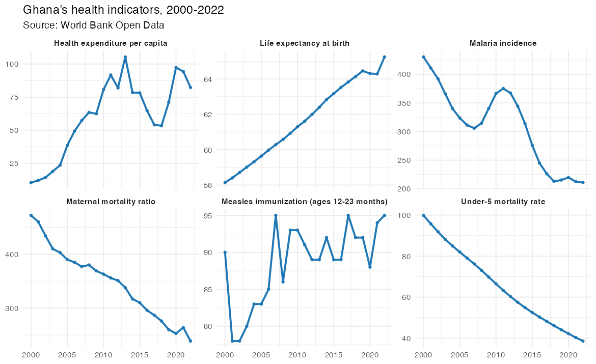
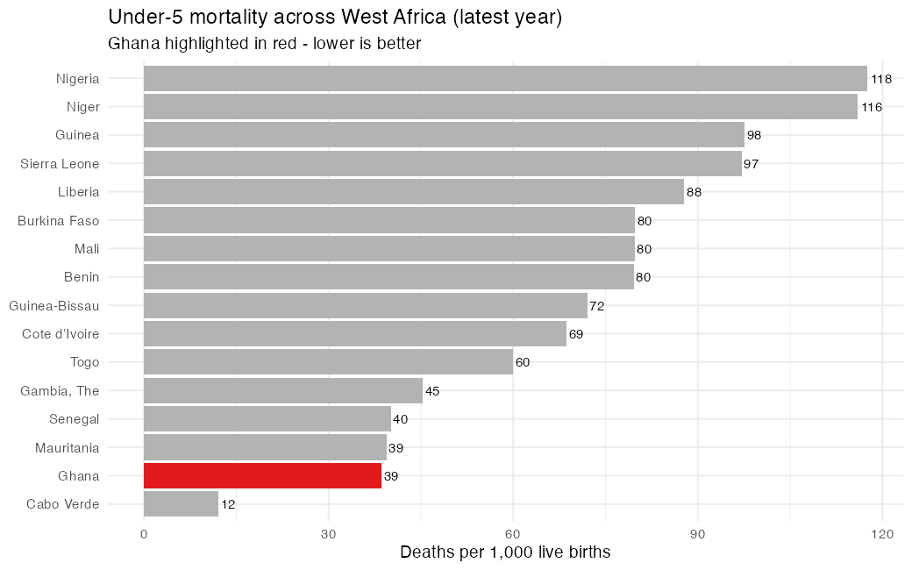

# Ghana & Africa Health Surveillance Dashboard

An end-to-end analytics project tracking key public-health indicators across **53 African countries (2000–2022)**, with a spotlight on **Ghana** and its West-African peers. Built from live **World Bank Open Data**, modelled as a clean star schema, and visualised in an interactive **Power BI / Tableau** dashboard.

> **The story in one line:** between 2000 and 2022 Ghana's under-5 mortality fell from **99.9 → 38.6** per 1,000, maternal mortality halved (**472 → 239**), malaria incidence more than halved, and life expectancy rose **+7 years** — while health spending per capita grew roughly **8×**.

### 🔗 Live interactive dashboard
**[▶ View the live dashboard](https://kingsley-amg.github.io/ghana-africa-health-dashboard/)** — pick an indicator, scrub the year, explore the Africa choropleth, Ghana-vs-peers trend, and country ranking.

*(A self-contained static dashboard — Plotly.js — that needs no server, hosted free on GitHub Pages.)*

---

## 📸 Preview

| Ghana's progress over time | West Africa benchmark |
|---|---|
|  |  |

*(These are validation charts produced in R. The interactive dashboard is built in Power BI / Tableau — see [DASHBOARD_GUIDE.md](DASHBOARD_GUIDE.md).)*

---

## 🎯 What this project demonstrates

- **Data engineering / ETL** — pulling live data from a public REST API, cleaning it, and shaping it into an analytics-ready model (R).
- **Dimensional modelling** — a proper star schema (1 fact + 3 dimension tables) that any BI tool can consume.
- **BI & dashboard design** — KPIs, trends, country benchmarking, and a geospatial choropleth map.
- **Domain insight** — framing the numbers as a public-health narrative, not just charts.
- **Reproducibility** — one script rebuilds the entire dataset from scratch.

---

## 🗂️ Repository structure

```
ghana-africa-health-dashboard/
├── 01_extract_worldbank.R       # ETL: pull from World Bank API -> clean star schema
├── 02_preview.R                 # validation / README preview charts
├── 03_build_dashboard_data.R    # export the data as docs/data.js for the live app
├── data/
│   ├── fact_health_long.csv     # fact table (tidy/long): iso3, year, indicator, value
│   ├── fact_health_wide.csv     # same data pivoted wide (handy for Tableau)
│   ├── dim_country.csv           # country dimension (region, income, lat/long, flags)
│   └── dim_indicator.csv         # indicator dimension (name, unit, category, direction)
├── docs/                         # the live, self-contained dashboard (GitHub Pages)
│   ├── index.html                # interactive Plotly.js app
│   └── data.js                   # data embedded for the app (generated)
├── preview/                      # PNG previews used in this README
├── DASHBOARD_GUIDE.md            # step-by-step build guide (Power BI + Tableau)
└── DATA_DICTIONARY.md            # every column explained
```

## 🧱 Data model (star schema)

```
        dim_country                 dim_indicator
        (iso3 PK)                   (indicator_code PK)
             \                          /
              \                        /
            fact_health_long (iso3, year, indicator_code, value)
```

- `fact_health_long` — one row per country × year × indicator (the grain).
- `dim_country` — joins on `iso3`; adds region, income level, coordinates, and `is_ghana` / `is_west_africa` flags.
- `dim_indicator` — joins on `indicator_code`; adds readable name, unit, category, and a `higher_is_better` flag for conditional formatting.

## 📊 Indicators (source: World Bank)

| Indicator | Unit | Category |
|---|---|---|
| Life expectancy at birth | years | Outcomes |
| Under-5 mortality rate | per 1,000 live births | Mortality |
| Infant mortality rate | per 1,000 live births | Mortality |
| Maternal mortality ratio | per 100,000 births | Mortality |
| Measles immunization (12–23 mo) | % of children | Prevention |
| DPT immunization (12–23 mo) | % of children | Prevention |
| Malaria incidence | per 1,000 at risk | Disease burden |
| Health expenditure per capita | current US$ | Resources |

## 🔁 Reproduce it yourself

```r
# Requires R with: jsonlite, dplyr, tidyr, readr, ggplot2
Rscript 01_extract_worldbank.R   # rebuilds the data/ folder from the live API
Rscript 02_preview.R             # regenerates the preview charts
```

No API key required. Data © World Bank, [CC BY 4.0](https://datacatalog.worldbank.org/public-licenses).

## 🛠️ Tools

R (jsonlite, tidyverse) · World Bank Open Data API · Power BI / Tableau · star-schema modelling

## 👤 Author

**Kingsley Amegah** — Health Data Scientist
GitHub: [@Kingsley-amg](https://github.com/Kingsley-amg) · LinkedIn: _add your profile link_
